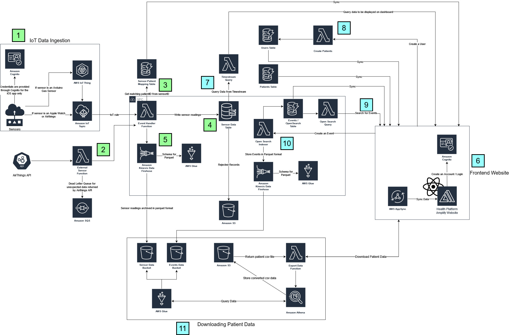

# Integrated Monitoring Health Platform
2m Foundation, First Place: Global Leadership Institute and Pacific Autism Family Network are centres of excellence and networks of support for individuals with Autism Spectrum Disorder and their families. Individuals on the autism spectrum are often at risk of experiencing unpredictable epileptic seizures. Therefore, in collaboration with the UBC Cloud Innovation Centre (CIC), a solution has been developed to monitor an individual using wearable and environmental sensors. This platform collects and integrates data from wearable and environmental sensors into a single UI.

| Index                                                 | Description                                               |
|:------------------------------------------------------|:----------------------------------------------------------| 
| [High Level Architecture](#High-Level-Architecture)   | High level overview illustrating component interactions   |
| [Deployment](#Deployment-Guides)                      | How to deploy the project                                 |
| [User Guide](#User-Guide)                             | The working solution                                      |
| [Changelog](#Changelog)                               | Any changes post publish                                  |
| [Credits](#credits)                                   | Credits for this project                                  |
| [License](#License)                                   | License details                                           |

# High Level Architecture

The following architecture diagram illustrates the various AWS components utliized to deliver the solution. For an in-depth explanation of the frontend and backend stacks, refer to [Architecture Deep Dive](docs/ArchitectureDeepDive.md).

# Deployment Guides

To deploy this solution, please follow our [Deployment Guides](docs/DeploymentGuide.md).

# User Guide

For instructions on how to use the web app interface, refer to the [User Guide](docs/UserGuide.md).

# Changelog

View the changelog [here](docs/Changelog.md).

# Credits

This project was architected and developed by Shrey Thapar, Tom Jin, Godot Bian, and Derrick Cheng, with guidance from the [UBC CIC](https://cic.ubc.ca/) technical and project management teams.

# License

This project is distributed under the [MIT License](./LICENSE).
