# User Guide

**Before Continuing with this User Guide, please make sure you have deployed the frontend and backend stacks, as well as any sensors you may have.**

- [Deployment Guides](./DeploymentGuide.md)

| Index                                                                                        | Description                                               |
|:---------------------------------------------------------------------------------------------|:----------------------------------------------------------| 
| [Creating an Account and Account Options](#Creating-an-Account-and-Account-Options)          | Create an account for caregiver/admin access              |
| [Main Dashboard](#Main-Dashboard)                                                            | How the main dashboard works                              |
| [Add Events](#Add-Events)                                                                    | Adding any events                                         |
| [Add Patients, Assign Caregivers, Assign Sensors, and Download Sensor and Event Data](#add-patients-assign-caregivers-assign-sensors-and-download-data)  | Setting up patients for monitoring                        |
| [Manage Account User Types](#Manage-Account-User-Types)                                      | Manage account types                                      |
| [Simulate Data](#Simulate-Data)                                                              | Simulate sensor data                                      |

## Creating an Account and Account Options

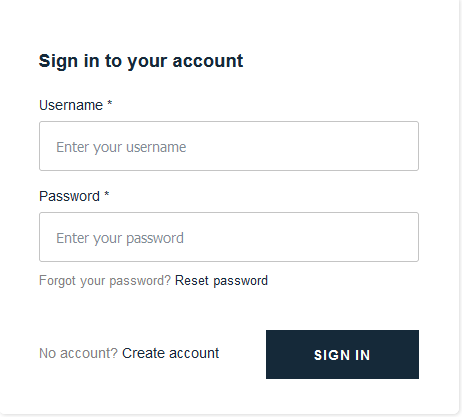

After deploying both the frontend and backend stacks, the user will see this login page after clicking the generated Amplify link. 

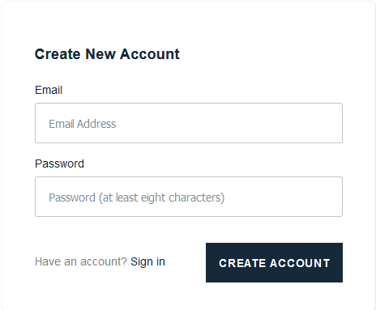
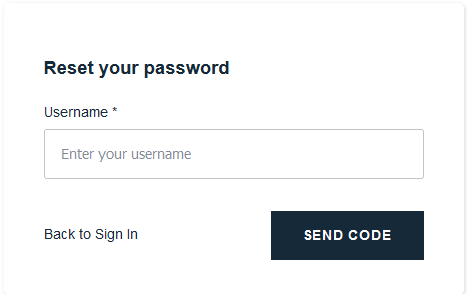

An account can be created or a password can be changed by clicking the respective buttons.

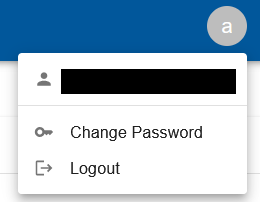
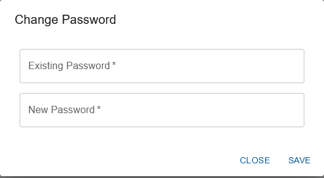

It is also possible to change a password through the dashboard by clicking on the user icon at the top right corner and clicking change password. This same menu is used to logout from an account.

Note that the very first user created will be automatically given ADMIN permissions. All users created after that will be UNCLASSIFIED.

## Main Dashboard

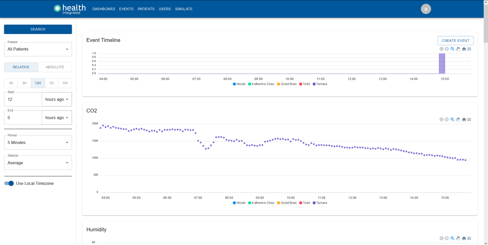

This is the main dashboard where the user will see all patient sensor data that has been recorded, as well as any events that have been input via the dashboard.

On the left sidebar specific timeframes for a search can be specified, as well as a specific patient. The patient dropdown menu allows the user to view the data of all  patients or a specific individual. A relative time interval specifies a timeframe in the format "start: 12 hours ago, end: hours ago". If the time and data is currently 05/31/2022 4:00 pm, the equivalent timeframe using an absolute time interval would be "start: 05/31/2022 4:00am, end: 05/31/2022 4:00pm". The period and statistic dropdown menus allow the user to control the granularity of the data displayed. If use local timezone is disabled, the dashboard will default to using the UTC timezone.

In the Event Timeline, the user will be able to see a timeline of all user inputted events for the specified patients. It is also possible to create events here by clicking the create event button. Reference [Add Events](#add-events) for more details.

Under the Event Timeline is the data of each datatype currently being monitored by the patients. Each datatype will have a separate graph that shows the data for the specified patients. Drag on the graph to zoom in, or use the controls on the top right of the graph to control the zoom.

## Add Events

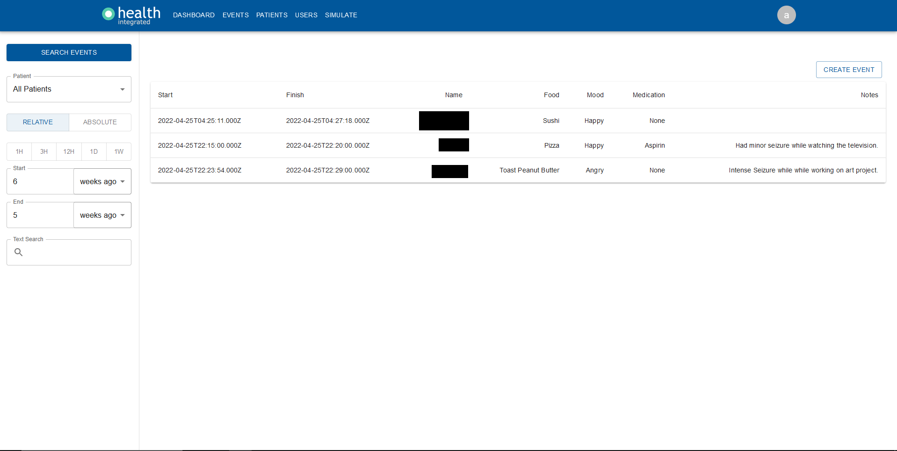

The events page displays all logged patient events found for the filters on the left. Caregivers are only allowed to see the events of patients who are assigned to them and new events can be logged on this page using the create event button. Events can also be searched by keyword by using the text search field.

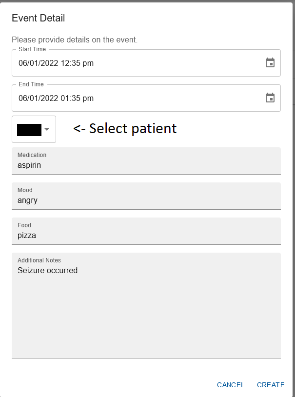

After selecting the create event the user will see this window. Select the start and end time for the event, the patient for which the event occured, and fill in the remaining applicable information about the event. Finish by clicking the create button at the bottom right corner. Your event will show up in the main events page if you have the correct timeframe selected.

## Add Patients, Assign Caregivers, Assign Sensors, and Download Data

The patients page displays all patients along with their assigned patients and sensors. The add patient button at the top right of the dashboard is used to add a patient, a unique patient id is assigned to them at this time. A patient's caregivers and sensors can be managed by clicking the respective manage buttons. The edit patient button allows the user to change the name of a patient.

### Add a Patient

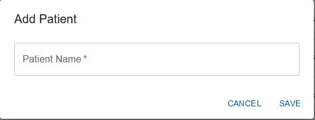

By clicking the add patient button, a new patient can be added. Be sure to click save at the bottom right corner after filling in the name.

### Assign Caregivers

Click the manage button next to a patient's caregivers will pull up this window. The user will be able to remove caregivers using the respective remove caregiver button, or add a caregiver using the button at the top right corner. **Make sure to click save after making any changes to a patient's caregivers.**

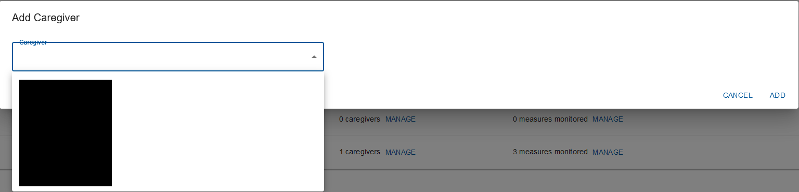

Add a caregiver by selecting a caregiver from the dropdown menu and clicking add. Make sure to click save on the manage caregivers page after.

### Assign Sensors

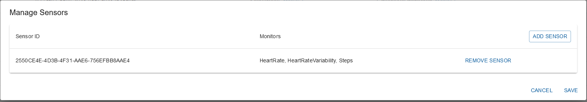

Clicking the manage button next to a patient's sensors will bring up a window with all their assigned sensors and what datatypes each sensor monitors. Sensors can be removed using the remove sensor button, or added using the add sensor button at the top right corner. **Make sure to click save after making any changes to a patient's sensors.**

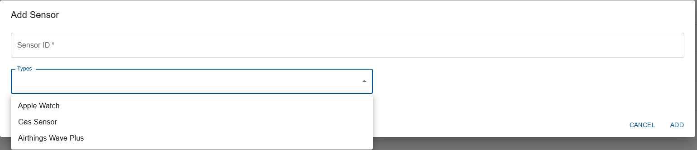

There are 3 types of sensors that are currently supported by the dashboard. The Apple Watch and Arduino gas sensor will provide a sensor ID for registration. An Airthings divice will also require a client ID and secret key.

- Apple Watch: The sensor ID can be found in the iOS app under the name "Device ID". More instructions can be found [here](https://github.com/UBC-CIC/health-platform-iOS-watchOS#ios-app-overview).

- Arduino Gas Sensor: The sensor ID can be found after connecting your Arduino sensor to an AWS IoT Thing. More instructions can be found [here](https://github.com/UBC-CIC/health-platform-arduino/blob/main/docs/arduino_sensor_setup.md).

- Airthings Wave Plus: Follow the deployment guide [here](https://github.com/UBC-CIC/health-platform/blob/main/docs/sensor_deployment/AirthingsDeployment.md).

- Biostrap EVO Wristband: Follow the deployment guide [here](https://github.com/UBC-CIC/health-platform/blob/main/docs/sensor_deployment/BiostrapDeployment.md).

### Download Sensor and Event Data

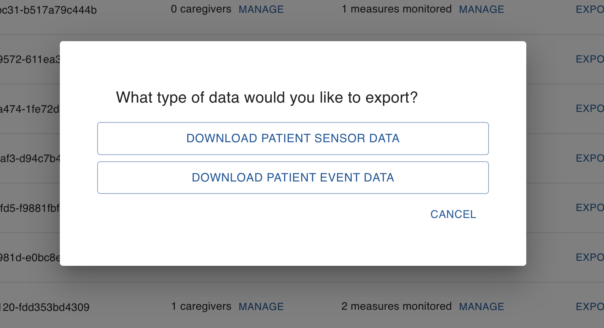

To download a patient's sensor or event data, simply click on Export Data -> Download Sensor Data or Download Event Data.

If you select 'Download All Data' it will fetch the patient data and download the CSV file to your machine. Please note that if a patient's dataset is very large, this may take a while.
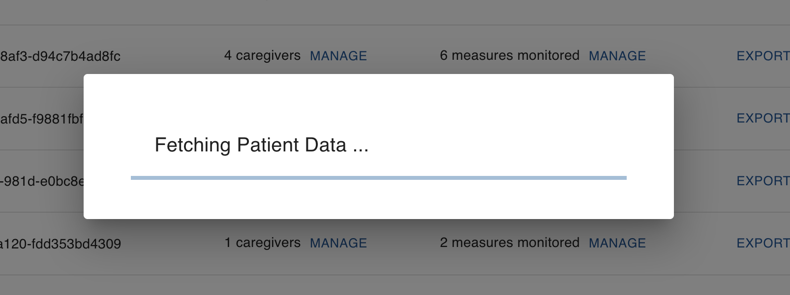

If you select 'Select A Date Range', you shall be prompted to select a range in between two dates. Select accordingly and click 'Download' to fetch the CSV file. 
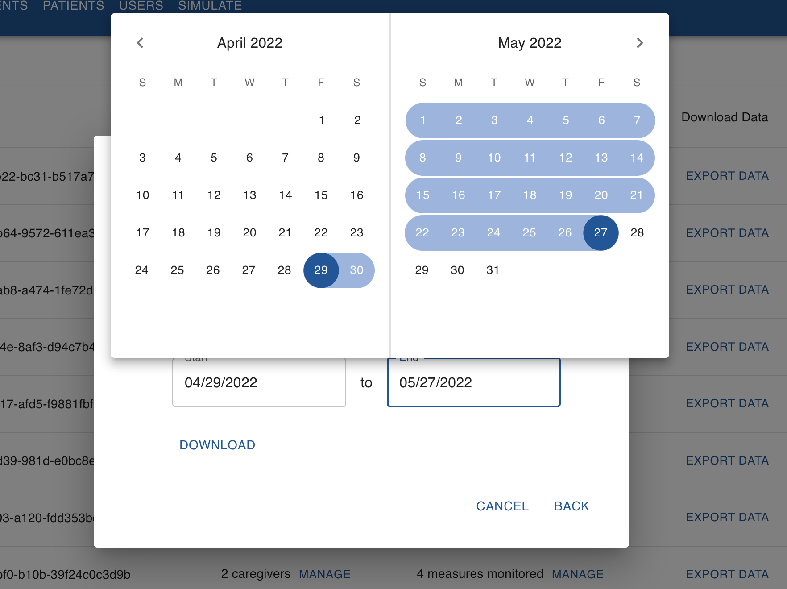

If the range selected is invalid or the individual patient's data does not exist, the following error shall be displayed.

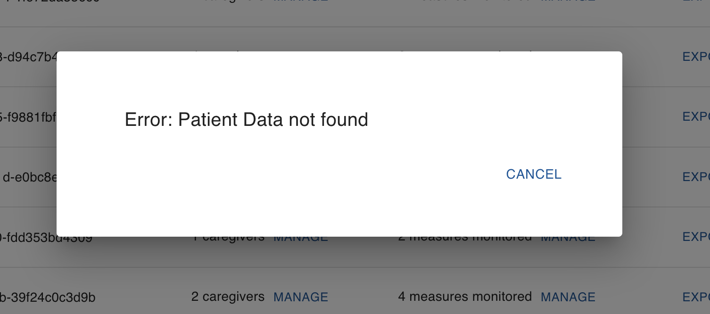

## Manage Account User Types

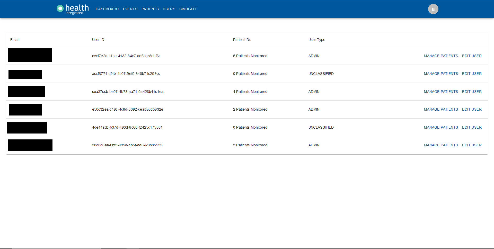

This page requires ADMIN permissions to access.

This page manages all of the users who have been registered through the website.

There are 3 types of users: 

- CAREGIVER: Permissions to view the dashboard, patients, and create events are assigned to the caregiver.

- ADMIN: Same as caregiver, with additional permissions to edit caregivers and assign patients. Both admins and caregivers can be a caregiver for a patient.

- UNCLASSIFIED: Upon registration, users are UNCLASSIFIED and do not have any data access permissions until they are assigned another user type.

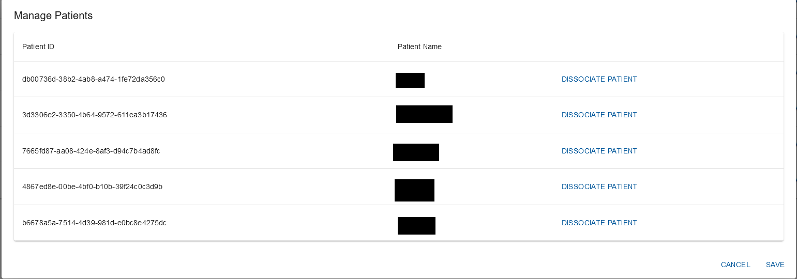

Clicking the manage patients button allows the user to see all patients a user is a caregiver for. Clicking dissociate patient will remove the user as the patient's caregiver. **Make sure to click save after making any changes to a user's patients.**

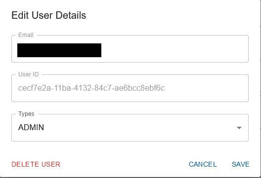

Use the edit user button to assign new accounts a role or change the role of a pre-existing account. Any newly created users are given the unclassified role, and any admin is able to assign either the caregiver or admin role to to an unclassified user. Admins can also change the role of an existing user. It is NOT possible to alter the User ID or email. It is also possible to delete a user by clicking the delete user button. **Make sure to click save after making any changes to a user's role.**

## Simulate Data

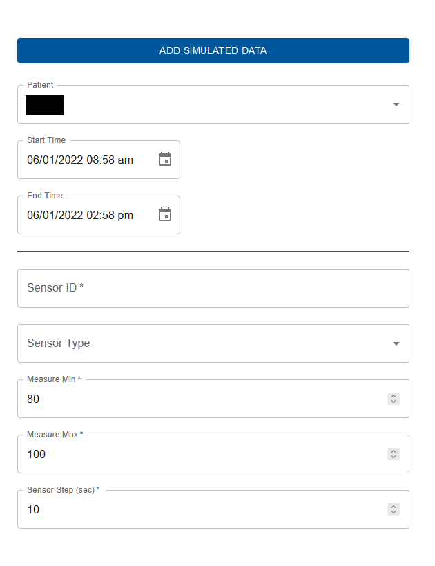

This page requires ADMIN permissions to access.

It may be inconvenient to populate data so, for development purposes, this page allows administrators to add simulated data for the provided sensor ID and patient.
