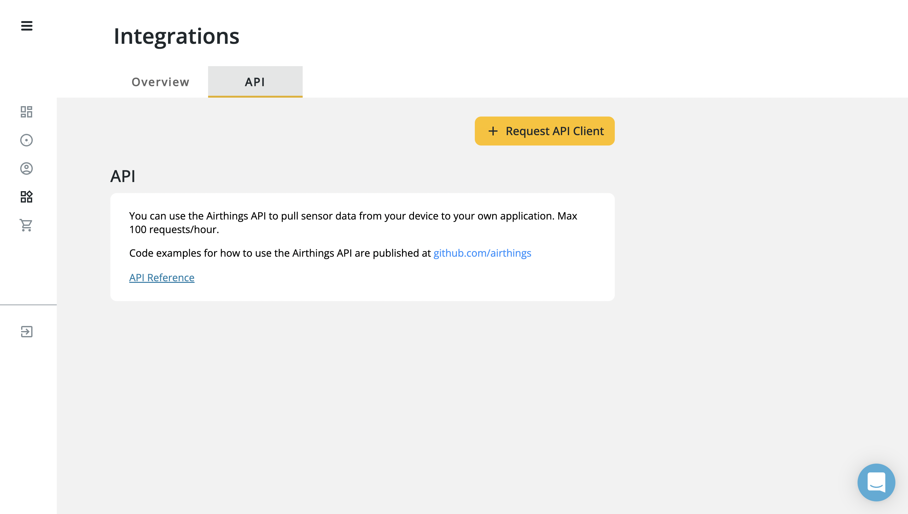
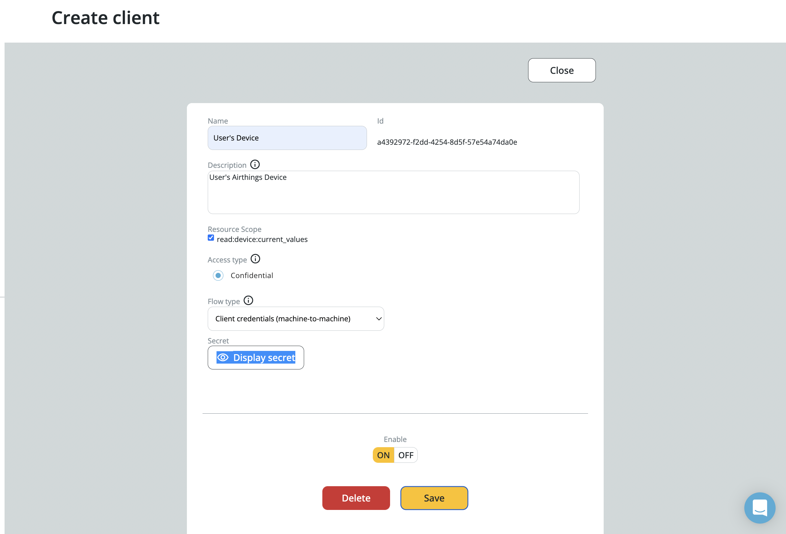
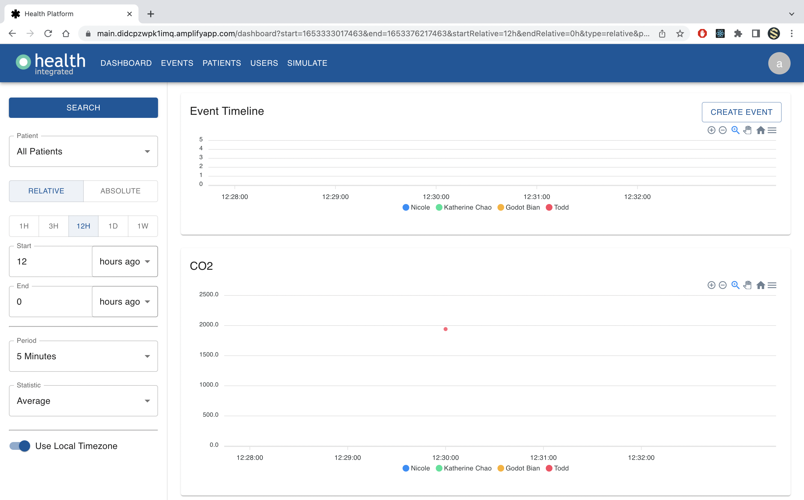

## Step 1: Device Setup
1. Unbox your Airthings Device and follow the steps in the setup guide provided in the box

2. You should now have an Airthings Device that is connected to the internet, paired to your phone and an Airthings account. 
3. Make note of the device serial number that appears when pairing, it is also visible near the battery compartment.

## Step 2: API Register and Setup
1. Login to your [Airthings Dashboard](https://accounts.airthings.com/login?client_id=dashboard&redirect_uri=https://dashboard.airthings.com)
2. Navigate to the Integrations page from the sidebar. Click on API -> Request API Client 

4. Fill out the name and description fields as deemed appropriate and ensure the following options match those in this image

5. Click Save; the page will now display a ‘client id’ on the top right and a ‘client secret’ at the bottom. Take note of these values.

## Step 3: Health Platform Device Integration
1. Log into the [Health Platform website](https://main.didcpzwpk1imq.amplifyapp.com) and navigate to the Patients page

2. Find the patient you want to add the sensor to, navigate to the sensor column, click on Manage -> Add Sensor 

3. Select the sensor type to be an Air Things Wave Plus. Then enter the Sensor ID, Client ID and Secret key which you got from your Airthings Dashboard. Select Add.

5. The Airthings sensor will now have been added to the dashboard and you will start to see CO2, Humidity, Pressure, Radon, Temperature, VOC, PM1 and PM2.5 readings. 

