# Step 1: Device Setup
1. Start by downloading the Biostrap app from the [App Store](https://apps.apple.com/ca/app/biostrap/id1187535208) or the [Google Play Store](https://play.google.com/store/apps/details?id=com.wavelethealth.biostrap).

2. Open the app and create a Biostrap account. 

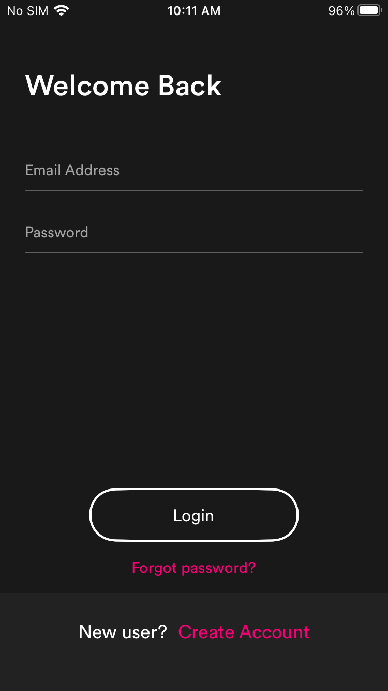
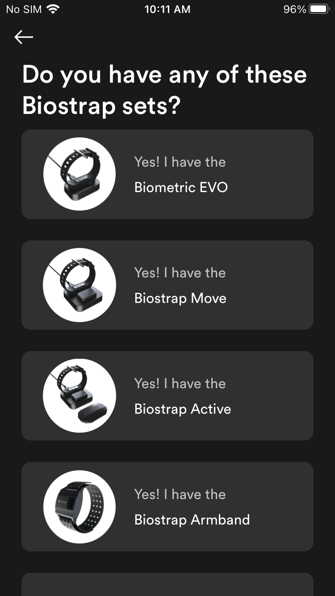
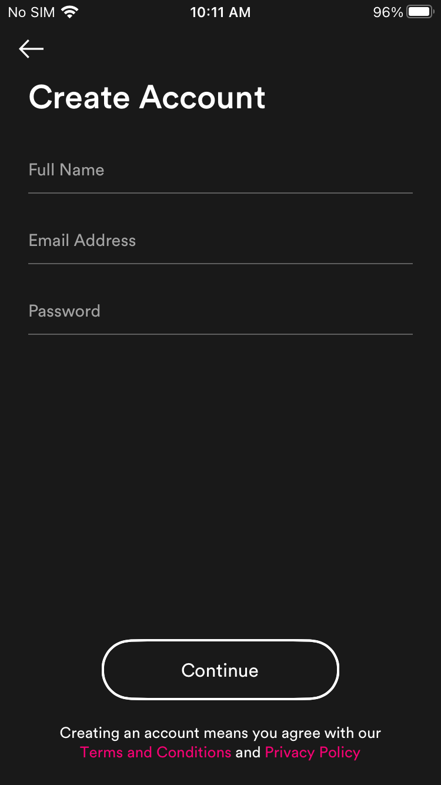

3. Head to the Settings page at the bottom right hand corner and tap Add Device to begin connecting your devices. Wait until your wristband shows up then tap it to connect. If the connection is successful, you should see your device appear next to the Add Device button.

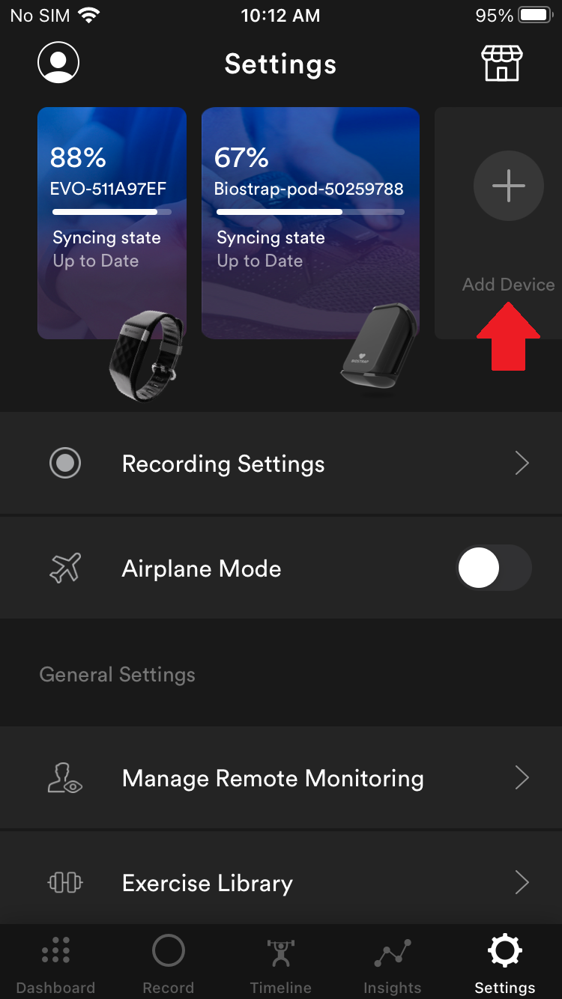
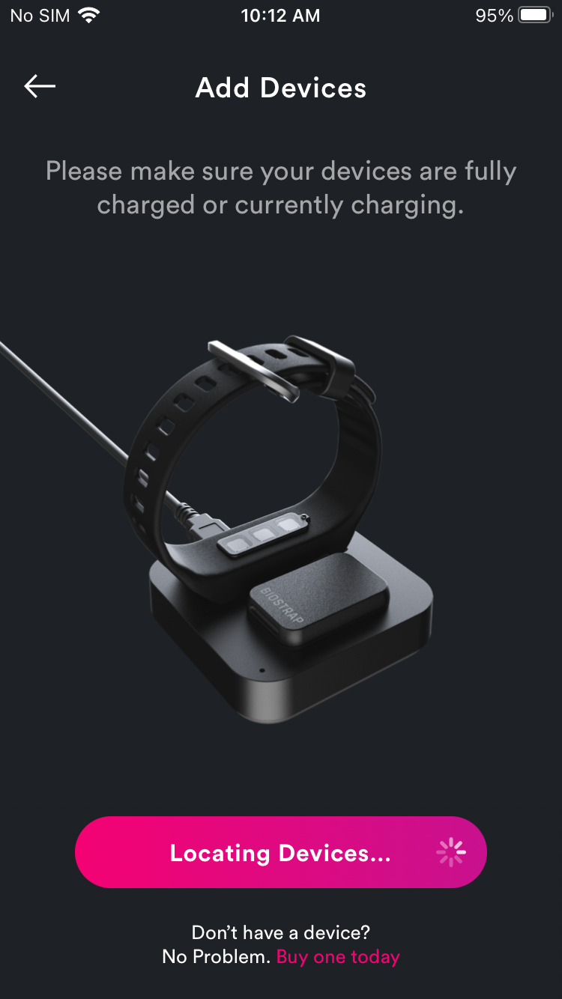

4. Next, head to Recording Settings. Ensure that Passive Biometric Recording Frequency is set to Every 5 Min, Daytime Biometric Recordings is enabled, and Daytime SPO2 Recordings is enabled.

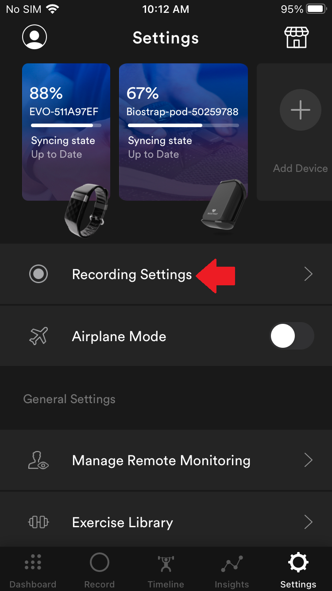
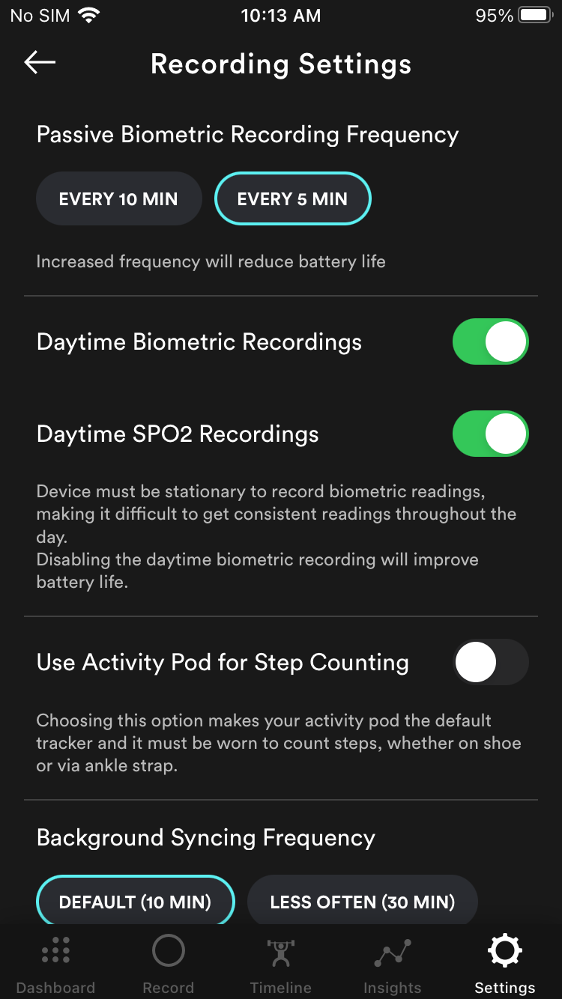

# Step 2: Add Account to Organization and Retrieve API Key
1. Login to the [Biostrap Dashboard](https://app.biostrap.com/) for your organization.

2. Navigate to the Users -> User Management page using the sidebar. Click on Invite Single User and add the Biostrap account you just created. You will receive an email inviting you to join the organization.

3. Next, navigate to the Organization API -> API Keys page and create an API Key. Copy this key to use later when registering the Biostrap in the Health Platform website.

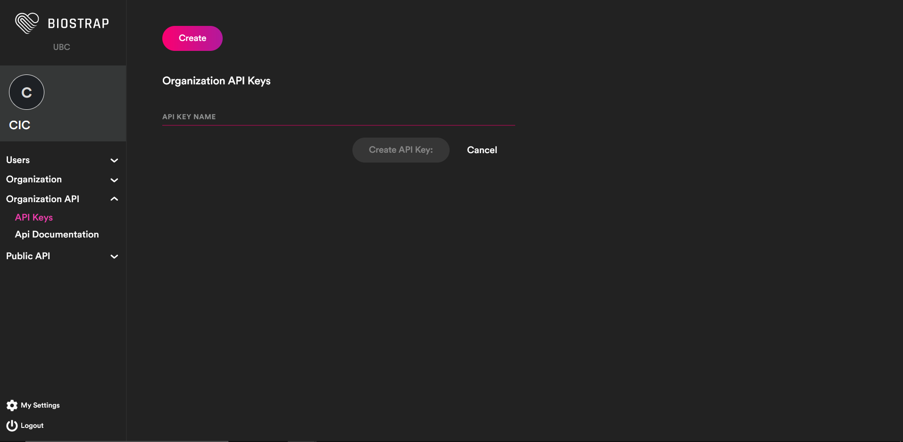
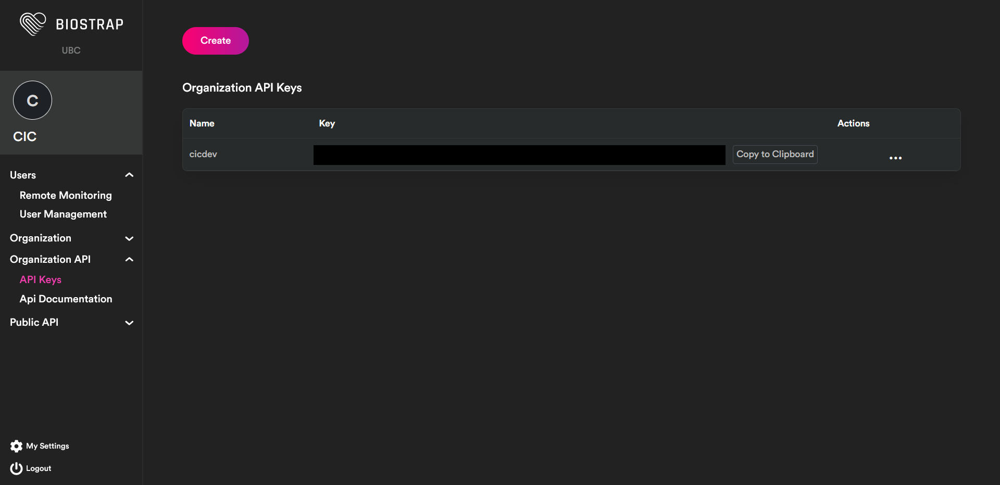

# Step 3: Health Platform Device Integration
1. Log into the Health Platform website and navigate to the Patients page
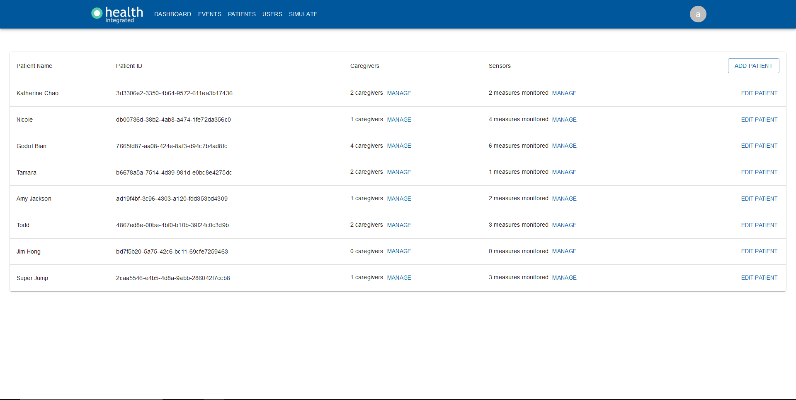

2. Find the patient you want to add the sensor to, navigate to the sensor column, click on Manage -> Add Sensor 

3. Select the sensor type to be a Biostrap. Make sure to click save after filling out the required fields.
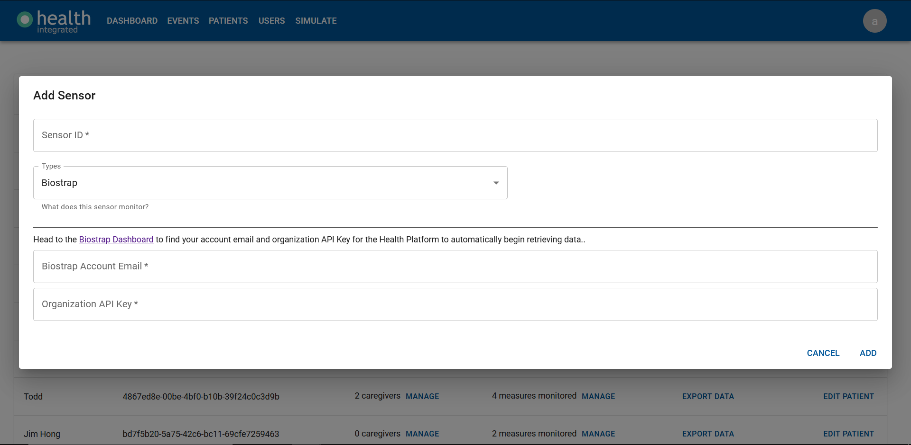

- Device ID: In the Biostrap app, head to the settings page and find your device ID there.
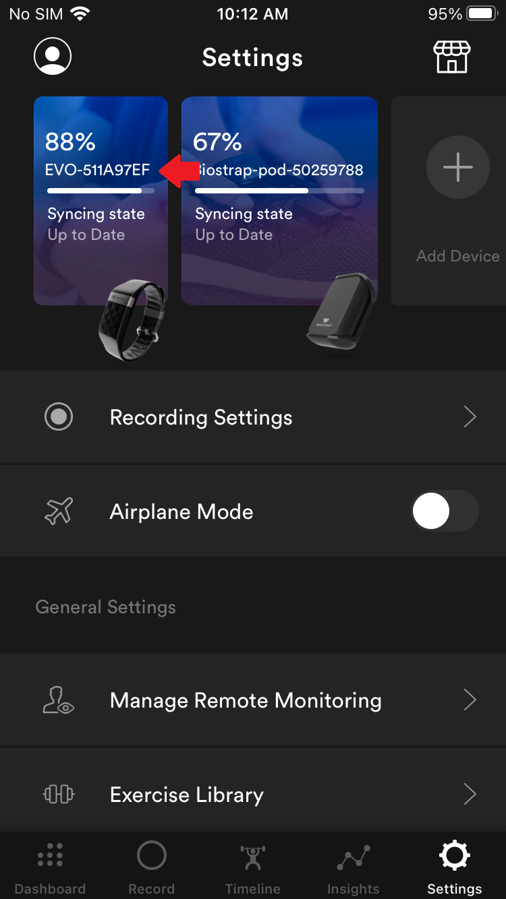

- Biostrap Account Email: The email you used to create your Biostrap account.

- Organization API Key: The Organization key you create earlier in [Step 2](#step-2-add-account-to-organization-and-retrieve-api-key).

4. The Biostrap sensor will now have been added to the dashboard and you will start to see Heart Rate, Heart Rate Variability, Respiratory rate, and Oxygen Saturation. 
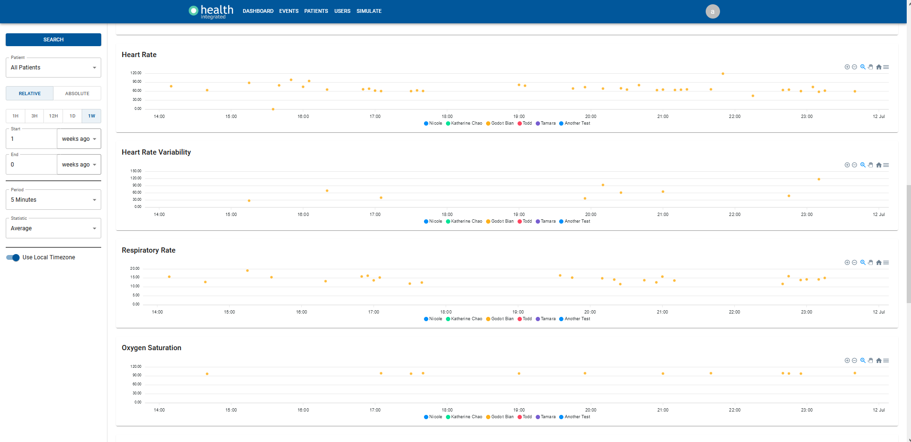
